# Deep Research - 对话流程架构图

## 概述

本文档详细描述了Deep Research应用中一次对话过程中的完整流程，包含涉及的所有类和核心方法。整个架构采用Vue 3 + TypeScript + Pinia的现代化前端架构。

## 架构流程图

```mermaid
graph TB
    %% 用户交互层
    User[用户] --> |"输入消息"| ChatView[ChatView.vue]
    ChatView --> |"切换深度模式"| DeepSwitch[深度模式开关]

    %% Vue组件层
    subgraph "Vue Component Layer"
        ChatView --> |"submitHandle()"| MessageStore[MessageStore]
        ChatView --> |"useChat()"| ChatComposable[useChat Composable]
        ChatView --> |"useThoughtChainBuilder()"| ThoughtBuilder[ThoughtChainBuilder]
        ChatView --> |"useMessageParser()"| MessageParser[MessageParser]
        ChatView --> |"useFileUploadHandler()"| FileHandler[FileUploadHandler]
    end

    %% Store层
    subgraph "Pinia Store Layer"
        MessageStore --> |"nextAIType()"| AITypeState[AIType状态管理]
        MessageStore --> |"addReport()"| ReportStore[报告数据存储]
        MessageStore --> |"current.convId"| ConvId[会话ID]
        MessageStore --> |"history[convId]"| MessageHistory[消息历史]
    end

    %% Composable层
    subgraph "Composable Layer"
        ChatComposable --> |"sendChatStream()"| ChatService[ChatService]
        ChatComposable --> |"sendResumeStream()"| ResumeService[ResumeService]
        ChatComposable --> |"useXChat()"| XChat[XChat Hook]

        ThoughtBuilder --> |"buildStartDSThoughtChain()"| StartDSChain[开始深度研究链]
        ThoughtBuilder --> |"buildOnDSThoughtChain()"| OnDSChain[深度研究进行链]
        ThoughtBuilder --> |"buildEndDSThoughtChain()"| EndDSChain[结束深度研究链]

        MessageParser --> |"parseLoadingMessage()"| LoadingParser[加载消息解析]
        MessageParser --> |"parseSuccessMessage()"| SuccessParser[成功消息解析]
        MessageParser --> |"parseFooter()"| FooterParser[页脚解析]

        FileHandler --> |"handleFileUpload()"| UploadHandler[文件上传处理]
        FileHandler --> |"beforeUpload()"| UploadValidator[上传验证]
    end

    %% Service层
    subgraph "Service Layer"
        ChatService --> |"sendChatStream()"| APIBackend[后端API]
        ResumeService --> |"sendResumeStream()"| APIBackend
        ConfigService[ConfigStore] --> |"chatConfig"| ChatConfig[聊天配置]
    end

    %% 后端处理
    subgraph "Backend Layer"
        APIBackend --> |"SSE流式响应"| StreamResponse[流式响应]
        StreamResponse --> |"chunk数据"| StreamProcessor[流式处理器]
        StreamProcessor --> |"onUpdate回调"| UIUpdater[UI更新器]
        StreamProcessor --> |"messageStore.addReport()"| ReportStorage[报告存储]
    end

    %% 消息类型处理
    subgraph "Message Processing"
        LoadingParser --> |"pending类型"| PendingNode[待处理节点]
        LoadingParser --> |"onDS类型"| OnDSNode[深度研究节点]

        SuccessParser --> |"chat类型"| ChatNode[聊天节点]
        SuccessParser --> |"startDS类型"| StartDSNode[开始深度研究节点]
        SuccessParser --> |"endDS类型"| EndDSNode[结束深度研究节点]
        SuccessParser --> |"termination类型"| TerminationNode[终止节点]
    end

    %% UI渲染层
    subgraph "UI Rendering"
        StartDSChain --> |"VNode渲染"| ThoughtChain[思考链组件]
        OnDSChain --> ThoughtChain
        EndDSChain --> ThoughtChain

        ChatNode --> |"h()函数"| MDComponent[MD组件]
        MessageHistory --> |"computed"| BubbleList[气泡列表]
        BubbleList --> |"Bubble.List"| BubbleComponent[气泡组件]
    end

    %% 报告系统
    subgraph "Report System"
        ReportStorage --> |"threadId"| ReportComponent[Report组件]
        ReportComponent --> |"getReport()"| ReportService[ReportService]
        ReportService --> |"exportPDF/MD"| ExportService[导出服务]
    end

    %% 样式定义
    classDef userLayer fill:#e1f5fe
    classDef vueLayer fill:#f3e5f5
    classDef storeLayer fill:#e8f5e8
    classDef composableLayer fill:#fff3e0
    classDef serviceLayer fill:#fce4ec
    classDef backendLayer fill:#f1f8e9
    classDef messageLayer fill:#e0f2f1
    classDef uiLayer fill:#e8eaf6
    classDef reportLayer fill:#fff8e1

    class User userLayer
    class ChatView,DeepSwitch vueLayer
    class MessageStore,AITypeState,ReportStore,ConvId,MessageHistory storeLayer
    class ChatComposable,ThoughtBuilder,MessageParser,FileHandler,XChat composableLayer
    class ChatService,ResumeService,ConfigService,ChatConfig serviceLayer
    class APIBackend,StreamResponse,StreamProcessor,UIUpdater,ReportStorage backendLayer
    class LoadingParser,SuccessParser,FooterParser,PendingNode,OnDSNode,ChatNode,StartDSNode,EndDSNode,TerminationNode messageLayer
    class StartDSChain,OnDSChain,EndDSChain,ThoughtChain,MDComponent,BubbleList,BubbleComponent uiLayer
    class ReportComponent,ReportService,ExportService reportLayer
```

## 核心类和方法详细说明

### 🎯 Vue组件层 (Vue Component Layer)

#### ChatView.vue (`src/views/chat/index.vue`)
- **`submitHandle(nextContent: any)`** - 消息提交处理入口
  - 设置 `current.aiType = 'normal'`
  - 调用 `messageStore.nextAIType()`
  - 执行 `onRequest(nextContent)`
  - 更新会话标题

- **`parseMessageRef(status: MessageStatus, msg: string)`** - 消息解析包装函数
  - 处理 'local' | 'loading' | 'success' | 'error' 状态
  - 调用对应的解析器构建UI内容

- **`startDeepResearch()`** - 开始深度研究
  - 调用 `messageStore.nextAIType()`
  - 发送 '开始研究' 消息

- **`openDeepResearch(threadId: string)`** - 打开深度研究详情
  - 设置 `current.threadId`
  - 切换 `current.deepResearchDetail` 状态

### 🗄️ Pinia Store层 (Pinia Store Layer)

#### MessageStore (`src/store/MessageStore.ts`)
- **`nextAIType()`** - AI类型状态切换
  - 管理不同的AI处理状态
  - 支持 'normal' | 'startDS' | 'onDS' | 'endDS'

- **`addReport(chunk: any)`** - 报告数据存储
  - 存储流式接收的报告数据
  - 支持按threadId组织数据

- **`current: MessageState`** - 当前会话状态
  - 包含 `deepResearch` 标志
  - 包含 `threadId` 和 `aiType`

#### ConfigStore (`src/store/ConfigStore.ts`)
- **`chatConfig`** - 聊天配置管理
  - `auto_accepted_plan` - 自动接受计划
  - 其他聊天相关配置

### 🔧 Composable组合式函数层 (Composable Layer)

#### useChat (`src/composables/useChat.ts`)
- **`sendChatStream(message, onUpdate, onError)`** - 流式聊天请求
  - 调用 `chatService.sendChatStream()`
  - 处理深度模式标志 `enable_deepresearch`
  - 实时更新UI和存储报告

- **`sendResumeStream(message, onUpdate, onError)`** - 人类反馈请求
  - 处理用户反馈信息
  - 支持 `feedback_content` 参数

- **`useXChat()`** - Ant Design X Vue集成
  - 提供agent基础的聊天能力
  - 处理请求占位符和错误回退

#### useThoughtChainBuilder (`src/composables/useThoughtChainBuilder.ts`)
- **`buildStartDSThoughtChain(data: any[])`** - 构建开始深度研究思考链
  - 返回 `VNode[]` 类型的思考链组件
  - 使用Vue的 `h()` 函数创建组件

- **`buildOnDSThoughtChain(data: any[])`** - 构建深度研究进行中思考链
  - 显示研究进度和状态
  - 支持实时更新

- **`buildEndDSThoughtChain(data: any[])`** - 构建结束深度研究思考链
  - 显示研究结果摘要
  - 提供查看详情的入口

#### useMessageParser (`src/composables/useMessageParser.ts`)
- **`parseLoadingMessage(msg: string)`** - 解析加载状态消息
  - 返回 `{ type: 'pending' | 'onDS', data: any }`
  - 处理不同类型的加载状态

- **`parseSuccessMessage(msg: string)`** - 解析成功状态消息
  - 返回 `{ type: 'chat' | 'startDS' | 'endDS' | 'termination', content: string, data?: any }`
  - 处理聊天、深度研究开始/结束、终止等状态

- **`parseFooter(status: MessageStatus)`** - 解析消息页脚
  - 为不同状态的消息添加操作按钮
  - 支持重新生成等交互功能

#### useFileUploadHandler (`src/composables/useFileUploadHandler.ts`)
- **`handleFileUpload(options)`** - 文件上传处理
  - 支持拖拽和点击上传
  - 调用 `chatService.uploadFile()`

- **`beforeUpload(file)`** - 上传前验证
  - 验证文件类型和大小
  - 返回验证结果

### 🌐 Service服务层 (Service Layer)

#### chatService (`src/services/api/chat.ts`)
- **`sendChatStream(params, onUpdate, onError)`** - 发送流式聊天请求
  - 支持多种参数配置
  - 处理SSE流式响应
  - 实时调用 `onUpdate` 回调

- **`sendResumeStream(params, onUpdate, onError)`** - 发送反馈流式请求
  - 处理人类反馈信息
  - 支持线程化对话

- **`stopChat(params)`** - 停止聊天请求
  - 终止当前的对话线程

- **`uploadFile(params)`** - 文件上传服务
  - 支持多种文件格式
  - 返回上传结果

### 🖥️ 后端处理层 (Backend Layer)

#### SSE流式响应处理
- **`StreamResponse`** - 接收后端SSE流
- **`StreamProcessor`** - 处理流式数据块
- **`UIUpdater`** - 更新用户界面
- **`ReportStorage`** - 存储报告数据

### 📨 消息类型处理 (Message Processing)

#### 加载状态消息类型
- **`pending`** - 待处理状态 → `PendingNode`
- **`onDS`** - 深度研究进行中 → `OnDSNode`

#### 成功状态消息类型
- **`chat`** - 普通聊天 → `ChatNode`
- **`startDS`** - 开始深度研究 → `StartDSNode`
- **`endDS`** - 结束深度研究 → `EndDSNode`
- **`termination`** - 对话终止 → `TerminationNode`

### 🎨 UI渲染层 (UI Rendering)

#### 思考链组件
- **`ThoughtChain`** - 使用Ant Design X Vue的思考链组件
- **`MD Component`** - Markdown内容渲染组件
- **`Bubble List`** - 消息气泡列表
- **`Bubble Component`** - 单个消息气泡组件

### 📊 报告系统 (Report System)

#### Report组件 (`src/components/report/index.vue`)
- **`getReport(threadId)`** - 获取报告数据
- **`exportPDF(threadId)`** - 导出PDF格式报告
- **`exportMarkdown(threadId)`** - 导出Markdown格式报告

## 数据流向总结

### 🔄 完整对话流程

1. **用户输入** → `ChatView.submitHandle()`
2. **状态更新** → `MessageStore.nextAIType()`
3. **消息发送** → `useChat.sendChatStream()`
4. **API调用** → `chatService.sendChatStream()`
5. **流式响应** → 后端SSE返回chunk数据
6. **实时更新** → `onUpdate()` + `messageStore.addReport()`
7. **消息解析** → `useMessageParser.parseXXXMessage()`
8. **UI渲染** → 思考链组件或MD组件
9. **报告生成** → Report组件展示

### 🎯 关键特性

- **响应式架构** - 基于Vue 3响应式系统
- **类型安全** - 完整的TypeScript类型定义
- **模块化设计** - 清晰的分层架构
- **实时流式** - SSE实现真正的实时通信
- **状态管理** - Pinia统一管理应用状态
- **组件复用** - Composable函数提高代码复用性

这种架构设计确保了代码的可维护性、可扩展性和性能表现，为用户提供了流畅的深度研究体验。